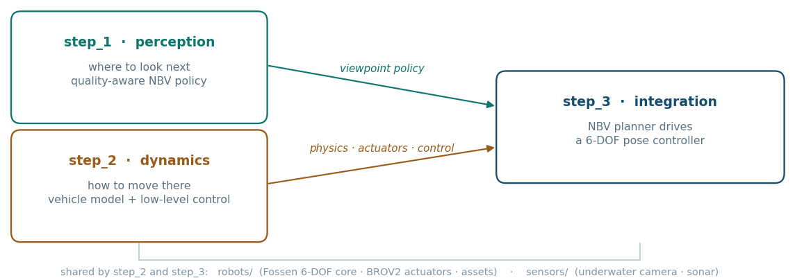
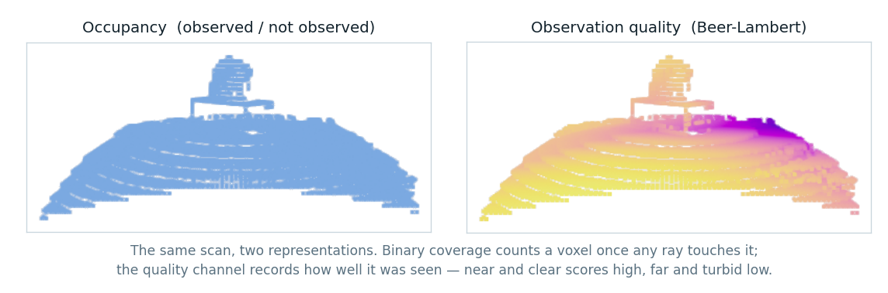
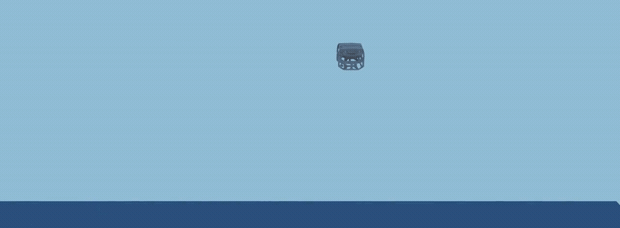
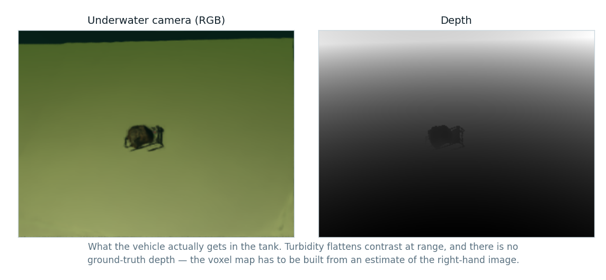

# underwater_NBV

Reinforcement learning for **autonomous underwater inspection**: teaching a
BlueROV2-class vehicle to decide *where to look next* at an unknown object, and
to actually *get there* under real underwater dynamics.

The two halves are hard for different reasons, so they are solved separately and
then joined. Perception planning (`step_1`) reasons about occlusion, turbidity
and view quality. Vehicle control (`step_2`) reasons about hydrodynamics,
thruster allocation and deployment latency. Integration (`step_3`) puts a
next-best-view planner on top of a controller that can hold a commanded pose.

> Research code for an unpublished study. Interfaces move; each stage keeps its
> own design notes, and this file only says what the stages are and how they fit.



## Repository layout

```
step_1_NBV/          perception  — where to look next
step_2_BROV/         dynamics    — how to move there
step_3_NBV_BROV/     integration — NBV planner + pose controller

robots/              shared vehicle model: Fossen 6-DOF core, BROV2 actuators, USD assets
sensors/             shared sensor models: underwater camera, imaging sonar
```

`robots/` and `sensors/` sit at the top level because `step_2` and `step_3` run
the *same* physics and the *same* optics. Promoting them out of `step_2` was a
deliberate refactor: a change to the drag coefficients or the thruster table has
to reach both stages at once, or the integration stage silently drifts from the
stage its controller was validated in.

A companion repository, **`brov_ros2`**, holds the ROS 2 deployment stack —
policy runtime, MAVLink interface, guidance and field diagnostics. The boundary
is clean: training and simulation live here, everything that talks to hardware
lives there.

---

## step_1 — Next-best-view planning

**Question.** Given partial observations of an unknown object, where should the
camera go next?

Underwater imaging makes this more than a geometry problem. Light is absorbed
and scattered on the way to the object *and* on the way back, so a viewpoint
that is geometrically ideal can be worthless in turbid water. The reward is
therefore not coverage but **observation quality**: a Beer-Lambert attenuation
model scores each ray, and the score accumulates into a voxel grid alongside the
usual occupancy.

**Setup.** Isaac Sim + IsaacLab, PPO. The agent moves on a sphere around the
target in discrete steps (azimuth, elevation, distance). It observes a short
history of images, a scalar view pose, and a 40³ voxel grid whose channels carry
*unknown / free / accumulated quality*. Water parameters are randomized during
training so the policy does not overfit one turbidity.



Baseline planners (GenNBV, ScanRL and variants) are implemented under
`algorithm/` and evaluated through one shared harness, so every method sees
identical episodes.

See [`step_1_NBV/CLAUDE.md`](step_1_NBV/CLAUDE.md).

---

## step_2 — Vehicle dynamics and low-level control

**Question.** Can a learned controller drive a real BlueROV2 Heavy?



Two threads live here. The first is a **physics ground truth**: a Fossen 6-DOF
model with measured BlueROV2 coefficients, a manufacturer-table thruster model
with third-order actuator dynamics, and axis-by-axis tests (neutral buoyancy,
straight-line, rotation, full 6-DOF) that must pass before any learning result
is believed.

The second is a **reproduction of Sim2Swim** (Fosso et al., SINTEF Ocean,
arXiv:2512.08656): a hierarchical scheme where classical line-of-sight guidance
generates a body-frame velocity command and an RL policy tracks it. The observed
state is error-only — attitude error, body velocity error, angular rate and
their integrals — with no absolute position, which is what lets the same policy
serve any guidance layer.

Reproducing it surfaced a coupling the paper does not discuss: the reward's
action penalty sets the achievable steady-state tracking, and lowering it to
track properly raises the policy's loop gain. In a simulator with no transport
delay that costs nothing; in a deployed loop it does. The stage therefore also
carries **delay-aware training** — action delay and observation staleness as
domain randomization — and the diagnostic tooling to measure loop delay in the
first place.

See [`step_2_BROV/CLAUDE.md`](step_2_BROV/CLAUDE.md).

---

## step_3 — Integration

**Question.** Does a next-best-view planner survive contact with a real vehicle
and a real camera?

Three substitutions turn the two stages into one system:

- **Guidance.** The line-of-sight module is replaced by an NBV policy that emits
  a target pose instead of a path to follow.
- **Low-level control.** A classical 6-DOF PID (dynamic positioning) executes
  those targets. This replaced an earlier velocity-cascade design: purely
  proportional control leaves a permanent steady-state error under constant
  disturbances such as buoyancy trim and centre-of-buoyancy offset, and settling
  *at* the commanded pose is exactly what a viewpoint command requires.
- **Perception input.** The voxel observation must be built from estimated depth
  rather than simulator ground truth, since a real tank provides none.



The binding constraint is generalization: tank water quality and the target
object are not known in advance, so reward and observation must be normalized to
be invariant to both. That normalization, not the planner, is the critical path.

See [`step_3_NBV_BROV/DEPLOY_3WEEK_PLAN.md`](step_3_NBV_BROV/DEPLOY_3WEEK_PLAN.md).

---

## Running

Everything runs inside containers; no stage is expected to work against a bare
host Python.

| Stage | Container | Entry point |
|---|---|---|
| step_1 | Isaac Sim | `python.sh train_GenNBV_quality.py` |
| step_2 | IsaacLab | `python.sh train.py --profile paper_ref_v1` |
| step_2 (validate physics) | IsaacLab | `python.sh validate_physics.py --test neutral_buoyancy` |
| step_3 | IsaacLab | `python.sh train.py` |

Policy evaluation in `step_2` reproduces the Sim2Swim trials directly:

```bash
python.sh test_policy.py --checkpoint <ckpt> --test straight_line
python.sh test_policy.py --checkpoint <ckpt> --test square_ballast --duration 60
python.sh test_policy.py --checkpoint <ckpt> --test square_random_attitude
```

## References

- Fosso, Amundsen, Xanthidis, Ohrem. *Sim2Swim: Zero-Shot Velocity Control for
  Agile AUV Maneuvering in 3 Minutes.* SINTEF Ocean. arXiv:2512.08656
- von Benzon et al. *An Open-Source Benchmark Simulator: Control of a BlueROV2
  Underwater Robot.* JMSE 2022, 10, 1898 — hydrodynamic coefficients, thrust limits
- Fossen. *Handbook of Marine Craft Hydrodynamics and Motion Control.* Wiley, 2011
- Chu et al. *MarineGym: A High-Performance RL Platform for Underwater Robotics.*
  IROS 2025. arXiv:2503.09203 — reference architecture for underactuated vehicles
